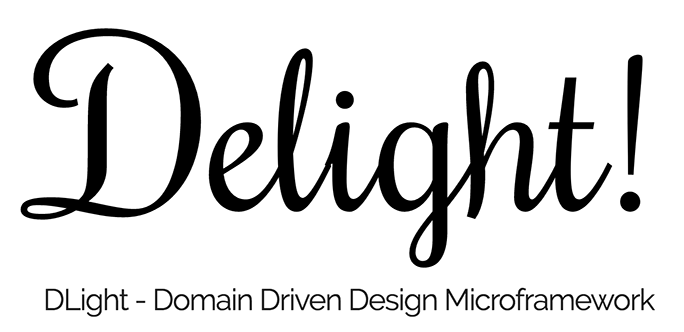
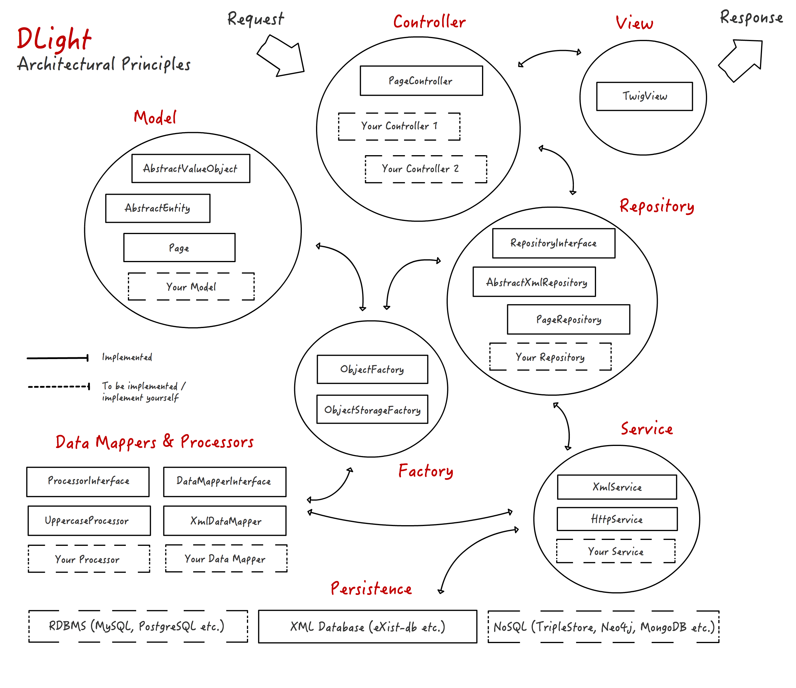

# **DLight**



### About

**DLight** (»_Delight_«) is a PHP microframework on top of [Slim](https://www.slimframework.com/) with a focus on a clean, object oriented software architecure and related design patterns.

**DLights** architecture adheres to the principles of [Domain Driven Design](https://en.wikipedia.org/wiki/Domain-driven_design). The main purpose of the the framework is to study software design patterns and web technologies in the master programme '[Digital Methods in the Humanities and Cultural Sciences](https://www.digitale-methodik.uni-mainz.de/)'.

At the same time, **DLight** and its [Slim](https://www.slimframework.com/) framework base make it possible to write clean and efficient APIs and HTTP-based web apps.

**DLight** is in an early beta stadium at the moment - fully usable and already used in production but not feature complete. Most notably at this stage are **DLights** domain, factory and mapper classes that make coupling and transforming XML content (e.g. from an [eXist XML database](http://exist-db.org/exist/apps/homepage/index.html)) a breeze.

**DLight** still expects you to write your own PHP code ;-) It simply provides you with a clean architectural base for the task.

### Requirements

+ Webserver with URL rewriting
+ PHP 5.5 or newer
+ [Composer](https://getcomposer.org/)

### Installation

DLight can be installed with Composer. Create a project directory and execute the following command:

```
composer require digicademy/dlight
```

This installs DLight in the _vendor_ directory of your project directory. Next, create a subdirectory (_public_ for example)
cd into the directory, create an index.php file and add the following:

```php
<?php

use Digicademy\DLight\Controller\PageController;

require __DIR__ . '/../vendor/autoload.php';

// BOOTSTRAP

require __DIR__ . '/../vendor/digicademy/dlight/config/framework.php';

$app = new \Slim\App(['settings' => $config]);

$container = $app->getContainer();

require __DIR__ . '/../vendor/digicademy/dlight/config/container.php';

// ROUTES

$app->get('/', PageController::class . ':indexAction')->setName('index.html');
$app->get('/index.html', PageController::class . ':indexAction')->setName('index.html');
$app->get('/test.html', PageController::class . ':testAction')->setName('test.html');

// RUN

$app->run();
```

Finally, point your webserver to your _public_ directory and add webserver specific rewrite rules so that all HTTP requests are routed through the index.php file. Example for the Apache webserver:

```bash
RewriteEngine On
RewriteCond %{REQUEST_FILENAME} !-f
RewriteCond %{REQUEST_FILENAME} !-d
RewriteRule ^ index.php [QSA,L]
```

Rewrite rules for other webservers can be looked up in the [Slim documentation](https://www.slimframework.com/docs/v3/start/web-servers.html)

Point your browser to the _public_ directory and you should be greeted with the DLight welcome page.

### Documentation

The following diagram gives an overview over DLights DDD architecture.



A more detailed documentation is currently in the making.

### License

This software is published under the terms of the MIT license.

### Research Software Engineering and Development

Copyright 2018, <a href="https://orcid.org/0000-0002-0953-2818">Torsten Schrade</a>  
Copyright 2018, <a href="http://www.adwmainz.de/">Academy of Sciences and Literature | Mainz</a>

Permission is hereby granted, free of charge, to any person obtaining a copy of this software and associated documentation files (the "Software"), to deal in the Software without restriction, including without limitation the rights to use, copy, modify, merge, publish, distribute, sublicense, and/or sell copies of the Software, and to permit persons to whom the Software is furnished to do so, subject to the following conditions:

The above copyright notice and this permission notice shall be included in all copies or substantial portions of the Software.

THE SOFTWARE IS PROVIDED "AS IS", WITHOUT WARRANTY OF ANY KIND, EXPRESS OR IMPLIED, INCLUDING BUT NOT LIMITED TO THE WARRANTIES OF MERCHANTABILITY, FITNESS FOR A PARTICULAR PURPOSE AND NONINFRINGEMENT. IN NO EVENT SHALL THE AUTHORS OR COPYRIGHT HOLDERS BE LIABLE FOR ANY CLAIM, DAMAGES OR OTHER LIABILITY, WHETHER IN AN ACTION OF CONTRACT, TORT OR OTHERWISE, ARISING FROM, OUT OF OR IN CONNECTION WITH THE SOFTWARE OR THE USE OR OTHER DEALINGS IN THE SOFTWARE.
